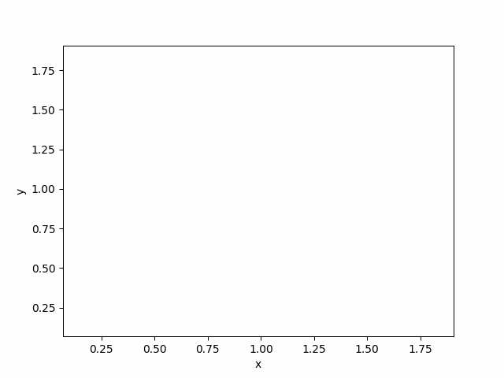
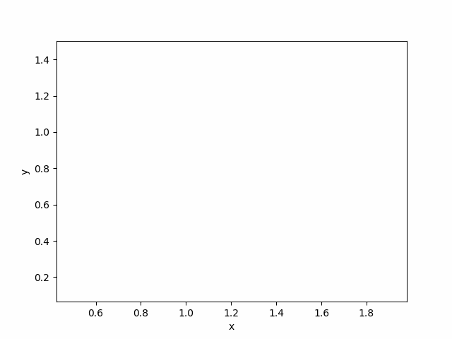

# Geometric algorythms labs 
## Description

This repository contains implementations of algorithms covered in the Geometric Algorithms course at AGH University of Krakow. It emphasizes fundamental geometric algorithms and data structures.

Laboratory materials, such as template notebooks, a visualizer, and tests, are provided by the [_BIT Scientific Group_](https://github.com/aghbit/Algorytmy-Geometryczne). 





## Table of Contents

| Laboratory      | Description                                      | Score | Source |
|-----------------|--------------------------------------------------|-------|--------|
| **Lab 1**       | Geometric Predicates                             | 19.5/20 | [Lab1](exercises/lab1) |
| **Lab 2**       | Convex Hull - Graham and Jarvis Algorithms       | 19/20 | [Lab2](exercises/lab2) |
| **Lab 3**       | Monotonic Polygon Triangulation                  | 18.5/20 | [Lab3](exercises/lab3) |
| **Lab 4**       | Line Intersection - Sweep Line Algorithm         | 17.5/20 | [Lab4](exercises/lab4) |

---

## Prerequisites
- Python 3.12 or later
- `pip` (Python package installer)

## Setup Instructions

### 1. Clone the Repository
Run the following command to clone the project:
```bash
git clone https://github.com/FloudMe77/geometric_algorithms_labs.git
cd geometric_algorithms_labs
```

### 2. Install Dependencies
Use `pip` to install all dependencies:
```bash
pip install -r requirements.txt
```

## Running the Project

### Executing Jupyter Notebooks
1. Start the Jupyter Notebook server:
   ```bash
   jupyter notebook
   ```
2. Navigate to the labs directory and open the notebook you want to work with, such as exercises/lab1/main.ipynb, in your preferred environment (e.g., VS Code or a web browser).



---